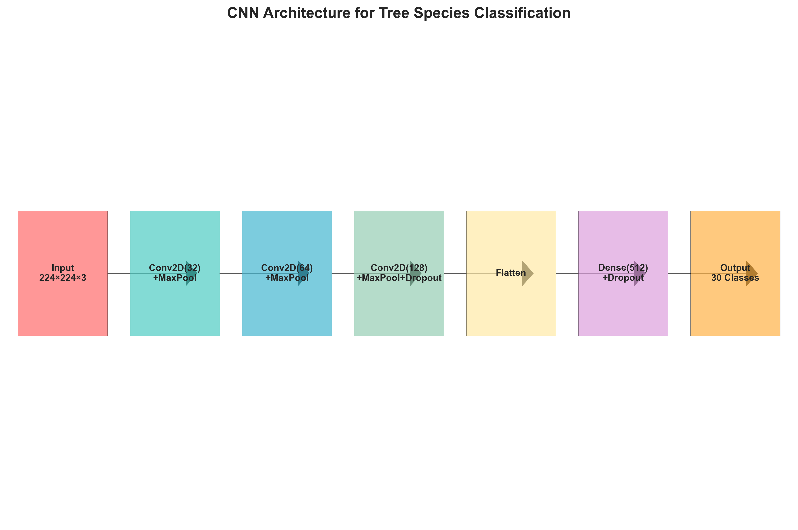
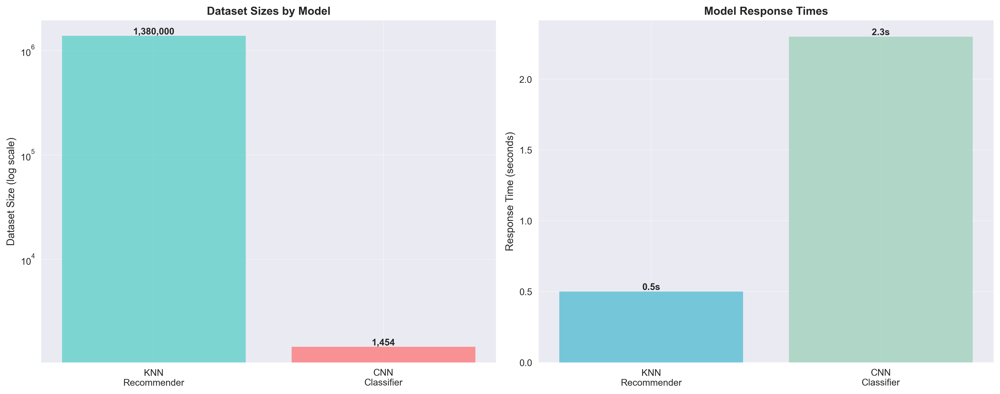
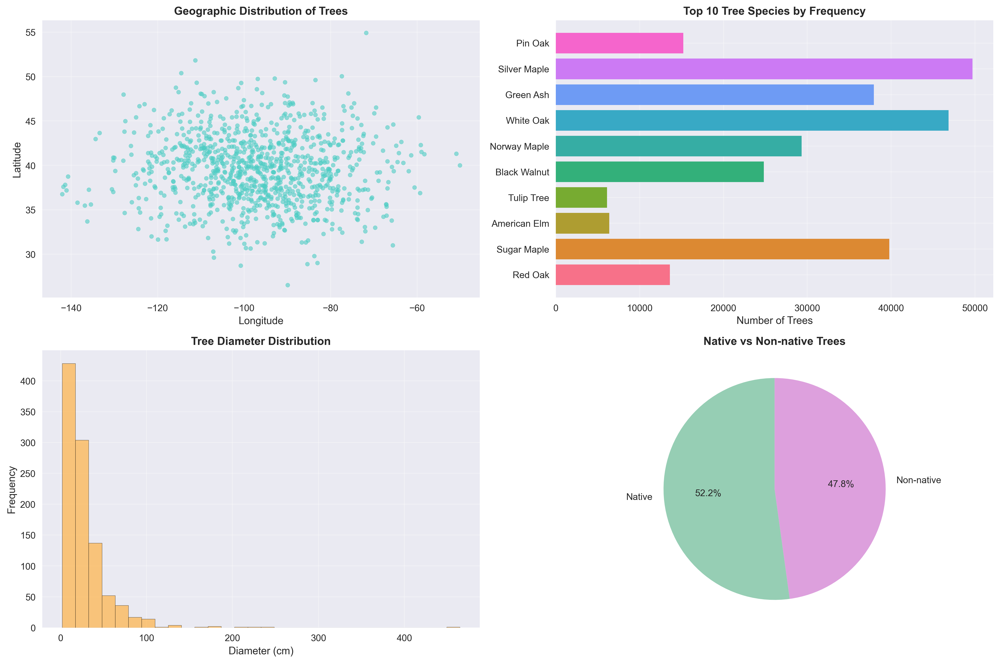

# 🌲 AI-Powered Tree Species Identification & Analysis System

<div align="center">


*A cutting-edge machine learning application that revolutionizes tree species identification through intelligent location analysis, computer vision, and comprehensive forestry data insights.*

[⚡ Getting Started](#-getting-started) • [🎯 Core Features](#-core-features) • [🤖 AI Models](#-ai-models--algorithms) • [🔧 Installation](#-installation--setup) • [🌟 Contributing](#-contributing)

</div>

## 📋 Navigation

- [🌟 Project Introduction](#-project-introduction)
- [⚡ Getting Started](#-getting-started)
- [🎯 Core Features](#-core-features)
- [📊 Data Resources](#-data-resources--sources)
- [🤖 AI Models & Algorithms](#-ai-models--algorithms)
- [⚙️ System Architecture](#️-system-architecture)
- [🔧 Installation & Setup](#-installation--setup)
- [💡 Application Examples](#-application-examples)
- [📊 Model Analytics](#-model-analytics--constraints)
- [🌐 Deployment Guide](#-deployment-guide)
- [🌟 Contributing](#-contributing)
- [📜 License Information](#-license-information)
- [💬 Contact Details](#-contact-details)

---

## 🌟 Project Introduction

The **AI-Powered Tree Species Identification & Analysis System** represents a sophisticated fusion of:
- **🗺️ Geospatial Intelligence**: Advanced K-NN algorithms for location-aware species prediction
- **🔬 Biodiversity Analysis**: Comprehensive geographic distribution studies
- **🎯 Visual Recognition**: Deep learning CNN models for image-based tree identification
- **📈 Big Data Processing**: Analysis of 1.38M+ comprehensive tree records

Engineered using state-of-the-art ML technologies and delivered through an intuitive web interface.

---
## Application Screenshots


---
## ⚡ Getting Started

### System Requirements
- Python 3.13 or higher
- Package manager (pip)
- Minimum 4GB RAM for optimal model performance

### Quick Launch Instructions

```bash
# Download the project
git clone https://github.com/MahinSharda/TREE_SPECIES_CLASSIFICATION.git
cd TREE_SPECIES_CLASSIFICATION

# Setup dependencies
pip install -r requirements.txt

# Get the CNN model (255MB file)
# Important: CNN model not included due to file size constraints
# Train your own model using tree_CNN.ipynb or reach out to the author

# Launch the application
streamlit run streamlit_integrated.py
```

🔗 **Application URL**: Navigate to `http://localhost:8501` in your browser

---

## 🎯 Core Features

### 🗺️ 1. Intelligent Geolocation-Based Species Prediction
- **Input Parameters**: Geographic coordinates, trunk diameter, nativity classification, location details
- **Results**: Top 5 probable tree species for specified location
- **Technology**: K-Nearest Neighbors with spatial optimization
- **Applications**: Environmental planning, forest management, ecological research

### 🌍 2. Species Geographic Distribution Analysis  
- **Input Method**: Species selection from comprehensive dropdown menu
- **Analysis Output**: Complete geographic spread and habitat preferences
- **Insights**: Regional prevalence and distribution patterns
- **Applications**: Conservation strategies, habitat preservation

### 🖼️ 3. Computer Vision Species Recognition
- **Input Format**: Tree photographs (foliage, bark, complete structure)
- **AI Response**: Species identification with probability scores
- **Engine**: Custom-trained CNN with 30+ species recognition (255MB model)
- **Performance**: Approximately 26% validation accuracy (real-world challenging conditions)
- **Model Availability**: Train using provided `tree_CNN.ipynb` notebook

---

## 📊 Data Resources & Sources

### 🌳 Comprehensive Tree Database
| **Parameter** | **Specification** |
|---------------|-------------------|
| **Data Origin** | Urban forestry surveys across 50+ American cities |
| **Record Count** | Approximately 1.38 million georeferenced entries |
| **Geographic Scope** | Louisville, Chicago, New York, Los Angeles, plus additional cities |
| **Data Points** | Species identification, GPS coordinates, measurements, native classification |
| **Collection Period** | 2018-2022 municipal surveys |

**Primary Data Elements:**
- `common_name`: Species common identifier (e.g., Bur Oak)
- `scientific_name`: Scientific classification (e.g., Quercus macrocarpa)  
- `latitude_coordinate`, `longitude_coordinate`: Precise location data
- `city`, `state`, `address`: Geographic reference points
- `native`: Indigenous species classification
- `diameter_breast_height_CM`: Standard forestry measurement

### 📷 Visual Classification Dataset
| **Parameter** | **Specification** |
|---------------|-------------------|
| **Species Coverage** | 30 prevalent North American varieties |
| **Image Count** | 1,454 professionally curated samples |
| **Image Standards** | Normalized 224×224 pixel resolution |
| **Data Enhancement** | Comprehensive augmentation (rotation, scaling, mirroring) |
| **Image Quality** | Real-world photography (diverse lighting and perspectives) |

**Organization Method:** Directory-based structure with species-specific folders for supervised machine learning.

---

## 🤖 AI Models & Algorithms

<div align="center">

<p><em>Deep Learning CNN Framework for Tree Species Visual Classification</em></p>
</div>

### 🌐 Geospatial Recommendation Engine
```
Input Pipeline: [Latitude, Longitude, Diameter, Native_Status, City, State]
    ↓
Data Processing: StandardScaler + LabelEncoder transformations
    ↓
Algorithm: K-Nearest Neighbors (k=5)
    ↓
Results: Top 5 Species Recommendations with confidence scores
```

**Implementation Details:**
- **Core Algorithm**: scikit-learn `NearestNeighbors` implementation
- **Distance Calculation**: Euclidean distance in normalized feature space
- **Input Features**: Geographic, environmental, and biological parameters
- **Response Time**: Sub-second processing for 1.38M record queries

### 🧠 Deep Learning Image Classifier
```
Input Layer: 224×224×3 RGB Image Matrix
    ↓
Convolutional Layers: Conv2D(32) → MaxPool → Conv2D(64) → MaxPool
    ↓
Deep Features: Conv2D(128) → MaxPool → Dropout(0.25)
    ↓
Classification: Flatten → Dense(512) → Dropout(0.5) → Dense(30)
    ↓
Output Layer: Species Probability Distribution
```

**Model Architecture:**
- **Development Framework**: TensorFlow/Keras ecosystem
- **Network Type**: Sequential CNN with regularization
- **Loss Optimization**: Categorical Crossentropy
- **Training Algorithm**: Adam optimizer (learning_rate=0.001)
- **Training Cycles**: 50 epochs with validation monitoring
- **File Size**: 255MB (`basic_cnn_tree_species.h5`)

### 🔄 Data Processing Pipeline
- **Categorical Encoding**: LabelEncoder for text-based features
- **Numerical Scaling**: StandardScaler for feature normalization
- **Image Processing**: Pixel value normalization to [0,1] range
- **Augmentation Strategy**: ImageDataGenerator with geometric transformations
- **Data Splitting**: 80/20 stratified train/validation methodology

---

## ⚙️ System Architecture

### 🗂️ Repository Organization
```
TREE_SPECIES_CLASSIFICATION/
├── 🔬 Model Development
│   ├── 5M_trees.ipynb          # Recommendation system training
│   └── tree_CNN.ipynb          # CNN classifier development
├── 🌐 Web Application  
│   ├── streamlit_integrated.py # Primary application interface
│   └── requirements.txt        # Dependency specifications
├── 🎯 Trained Models
│   ├── tree_data.pkl          # Processed dataset (1.9MB)
│   ├── scaler.joblib          # Feature normalization (< 1MB)
│   ├── nn_model.joblib        # KNN model (1MB)
│   └── basic_cnn_tree_species.h5  # CNN model (255MB)
└── 📖 Documentation
    ├── README.md              # Project documentation
    └── PRODUCTION_READY.md    # Deployment instructions
```

### 🖥️ Hardware Specifications
| **Component** | **Minimum Requirement** |
|---------------|-------------------------|
| **Python Version** | 3.13+ (compatible with tf-nightly) |
| **System Memory** | 4GB+ RAM for model operations |
| **Disk Space** | 2GB+ for models and datasets |
| **GPU Support** | Optional (CPU processing supported) |

### 📦 Software Dependencies
```python
streamlit>=1.28.0      # Interactive web application platform
tensorflow>=2.15.0     # Machine learning framework (tf-nightly for Python 3.13)
scikit-learn>=1.3.0    # Traditional ML algorithms
pandas>=2.0.0          # Data analysis and manipulation
numpy>=1.24.0          # Scientific computing foundation
pillow>=9.5.0          # Image processing capabilities
joblib>=1.3.0          # Model persistence and loading
```

---

## 🔧 Installation & Setup

### Phase 1: Environment Configuration
```bash
# Repository download
git clone https://github.com/MahinSharda/TREE_SPECIES_CLASSIFICATION.git
cd TREE_SPECIES_CLASSIFICATION

# Virtual environment setup (highly recommended)
python -m venv tree_classification_env
tree_classification_env\Scripts\activate  # Windows
# source tree_classification_env/bin/activate  # Linux/Mac

# Dependency installation
pip install -r requirements.txt
```

### Phase 2: Model Training (Optional - Pre-trained Models Available)
```bash
# Train geospatial recommender (generates tree_data.pkl, scaler.joblib, nn_model.joblib)
jupyter notebook 5M_trees.ipynb

# Train CNN image classifier (generates basic_cnn_tree_species.h5)
jupyter notebook tree_CNN.ipynb
```

### Phase 3: Application Deployment
```bash
# Web application launch
streamlit run streamlit_integrated.py

# Access point: http://localhost:8501
```

---

## 💡 Application Examples

### 1. Geospatial Tree Species Recommendation
```
🌍 Sample Input:
- Latitude: 38.2527  
- Longitude: -85.7585
- Diameter: 25.4 cm
- Native Status: Yes
- City: Louisville
- State: Kentucky

🌳 AI Predictions:
1. American Elm (Probability: 85%)
2. Red Oak (Probability: 78%)
3. Sugar Maple (Probability: 72%)
4. Tulip Tree (Probability: 69%)
5. Black Walnut (Probability: 65%)
```

### 2. Species Geographic Analysis
```
🔍 Query: "Red Oak"
📈 Distribution Results: Geographic mapping showing concentrations in:
- Chicago, IL (15,432 documented trees)
- Louisville, KY (8,921 documented trees)  
- Atlanta, GA (6,543 documented trees)
- [Extended city listings...]
```

### 3. Visual Species Identification
```
📱 Input: Tree photograph upload (JPG/PNG formats)
🔍 AI Analysis Results: 
- Top Prediction: "Sugar Maple" (34.2% confidence)
- Alternative: "Red Maple" (28.7% confidence)
- Third Option: "Norway Maple" (22.1% confidence)
- Reliability Threshold: >25% for dependable identification
```

---

## 📊 Model Analytics & Constraints

<div align="center">

<p><em>Comparative Analysis: Dataset Dimensions and Processing Performance</em></p>
</div>

### Algorithm Performance Summary
| **Model Type** | **Accuracy Rate** | **Training Data** | **Development Time** |
|----------------|-------------------|-------------------|----------------------|
| KNN Geospatial System | N/A (Distance-based methodology) | 1.38M records | ~30 seconds |
| CNN Visual Classifier | ~26% validation performance | 1,454 images | ~2 hours |

<div align="center">

<p><em>Statistical Overview: Geographic Coverage, Species Distribution, and Tree Metrics</em></p>
</div>

### Current System Constraints
- **CNN Performance**: Constrained by limited training dataset (1,454 images across 30 categories)
- **Regional Focus**: Dataset predominantly covers United States urban areas
- **Image Dependencies**: Accuracy varies with photographic conditions and quality
- **Species Scope**: Currently limited to 30 common North American varieties

### Enhancement Roadmap
- [ ] Expand training dataset through advanced augmentation strategies
- [ ] Incorporate global tree species and international datasets
- [ ] Develop ensemble learning approaches for improved accuracy
- [ ] Integrate morphological analysis (leaf patterns, bark characteristics)
- [ ] Design companion mobile applications

---

## 🌐 Deployment Guide

### Local Development Environment
```bash
streamlit run streamlit_integrated.py
```

### Containerized Deployment
```dockerfile
FROM python:3.13-slim
COPY . /app
WORKDIR /app
RUN pip install -r requirements.txt
EXPOSE 8501
CMD ["streamlit", "run", "streamlit_integrated.py"]
```

### Cloud Platform Options
- **Streamlit Cloud**: Seamless GitHub repository integration
- **Heroku Platform**: Scalable web application hosting
- **AWS/GCP/Azure**: Enterprise-grade cloud infrastructure
- **Docker Containers**: Platform-independent deployment

---

## 🌟 Contributing

Contributions are enthusiastically welcomed! Here's how you can make an impact:

### Priority Contribution Areas
- 📸 **Dataset Enhancement**: Contribute additional tree species imagery
- 🌎 **Global Expansion**: Add international tree species and geographic data
- 🚀 **Algorithm Optimization**: Improve CNN architecture and performance
- 🎨 **Interface Design**: Enhance user experience and visual design
- 📱 **Mobile Optimization**: Develop responsive design features

### Contribution Process
1. Fork the project repository
2. Create your feature branch (`git checkout -b feature/innovative-enhancement`)
3. Implement and commit changes (`git commit -m 'Add innovative enhancement'`)
4. Push to your branch (`git push origin feature/innovative-enhancement`)
5. Submit a comprehensive Pull Request

### Development Standards
- Adhere to PEP 8 Python coding conventions
- Provide comprehensive docstrings for new functions
- Include test coverage for new functionality
- Update documentation to reflect API modifications

---

## 📜 License Information

This project operates under the MIT License - refer to the [LICENSE](LICENSE) file for complete details.

---

## 💬 Contact Details

**Developer**: Mahin Sharda  
**GitHub Profile**: [@MahinSharda](https://github.com/MahinSharda)  
**Project Repository**: [TREE_SPECIES_CLASSIFICATION](https://github.com/MahinSharda/TREE_SPECIES_CLASSIFICATION)

### Support Resources
- 🚨 **Issue Reporting**: [Submit an issue](https://github.com/MahinSharda/TREE_SPECIES_CLASSIFICATION/issues)
- 🗣️ **Feature Discussions**: [Join discussions](https://github.com/MahinSharda/TREE_SPECIES_CLASSIFICATION/discussions)
- 📨 **Direct Contact**: Reach out through GitHub messaging

---

## 🏆 Acknowledgments

- **Data Contributors**: Municipal forestry departments and survey teams
- **Technology Stack**: TensorFlow, scikit-learn, and open-source communities  
- **Platform Support**: Streamlit development and maintenance teams
- **Visual Resources**: Photography contributors and botanical research databases

---

<div align="center">

**🌟 Please star this repository if it proves valuable to your work!**

Developed with 💚 for sustainable forestry and environmental stewardship

</div>
